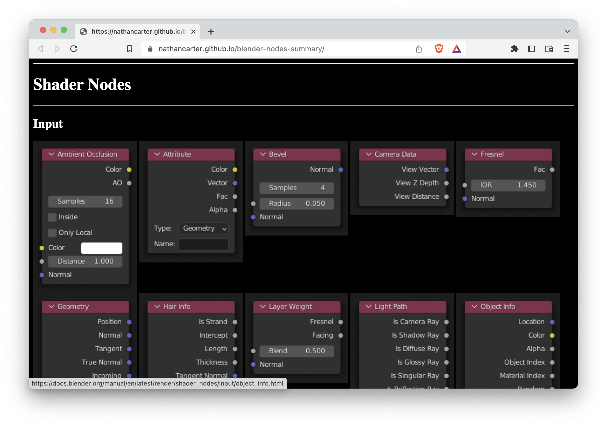

# Blender Nodes Summary

I created this to help myself study the node systems in Blender.

[Go to the page.](http://nathancarter.github.io/blender-nodes-summary)

## What does the code in this repo do?

You probably don't need to run it, but you can if you want to.  It does this:

 * [Scrapes](scrape_data.py) the latest version of Blender's manual, taking note
   of all URLs and images for the docs of all the shader and geometry nodes.
 * Saves that data into [a JSON file](scraped_data.json).
 * [Creates](build_page.py) a [webpage](index.html) summarizing all those nodes
   visually, organized by section, with links to the Blender docs.

You can skim the page for an overview of all the nodes, and click into any node
to see its docs.  The page's section headings also link to the original Blender
docs.
